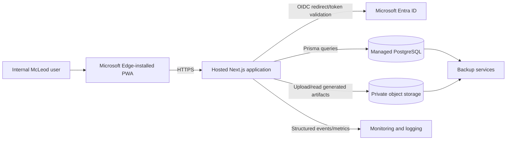

# P2-0 Deployment, Distribution, and Security Architecture Decision

Status: Draft recommendation for product-owner and IT review  
Date: 2026-07-13  
ADR: `docs/adr/ADR-001-p2-distribution-architecture.md`

## Executive recommendation

Recommended primary architecture: secure hosted internal web application with PostgreSQL, Microsoft Entra ID, private object storage, HTTPS, centralized operations, and Microsoft Edge PWA installation.

Recommended fallback: time-boxed hybrid pilot only if hosted approvals block pilot timing. The fallback may use the existing local-first application or a minimal desktop distribution path for a small controlled group, but the production target should remain hosted. A full Electron product should not be built unless offline use becomes a confirmed hard requirement.

This recommendation is consistent with the repository evidence: Phase 1 is a local-first single-user Next.js application that already separates calculation, persistence, snapshot, and presentation-generation logic well enough to reuse for a hosted application, but it currently depends on SQLite, local filesystem storage, unauthenticated routes, and unprotected generated-file downloads.

## Current-state inventory

### Runtime and framework requirements

- Runtime is Node.js 20. `package.json` declares `node >=20 <21`.
- Application is Next.js App Router with React 19 and TypeScript.
- `next dev`, `next build`, and `next start` are the current server lifecycle commands.
- The app requires a server-capable Next.js runtime because route handlers execute Prisma queries, filesystem reads/writes, and synchronous PPTX generation.
- The app is not currently configured as a static export or serverless-only artifact.

### Database and persistence

- Prisma is configured with a SQLite datasource using `DATABASE_URL`.
- The schema stores analyses, modules, module inputs, overlap dispositions, and presentation-generation metadata.
- `PresentationGeneration.snapshotJson` stores the immutable presentation snapshot as serialized JSON.
- `PresentationGeneration.filePath` stores a local filesystem path to the generated PPTX when generation succeeds.
- The Prisma client is a process-level singleton for development reuse.

### File upload and generated-file storage

- Customer logos are stored under the git-ignored local directory `customer-logos/`.
- Accepted logo file types are PNG, JPG/JPEG, WEBP, GIF, and SVG.
- Customer logo upload size is capped at 2 MB.
- Stored logo references are basenames in the database, then resolved back into the local logo directory.
- Generated PPTX files are stored under the git-ignored local directory `generated-presentations/`.
- HTML and PDF downloads are generated from the persisted snapshot on request rather than stored as files.
- Static presentation assets are read from `public/presentation-assets/`.

### Snapshot and generation behavior

- Presentation generation is synchronous in the route request path: POST generation creates a snapshot, creates a `PresentationGeneration`, writes the PPTX, validates the PPTX ZIP/package shape, updates status, and redirects to download.
- Generation states are `PENDING`, `GENERATING`, `COMPLETE`, and `FAILED`.
- Failed generation logs to server console and marks the generation `FAILED`.
- There is no background worker, durable queue, retry policy, or job lease model.
- The immutable snapshot embeds customer logo data as a data URI when a logo exists, making PDF/HTML/PPTX exports reproducible from snapshot data.

### Local filesystem assumptions

- Local directories `customer-logos/` and `generated-presentations/` must be writable by the Next.js process.
- `filePath` is expected to be a local path under `generated-presentations/` for PPTX download.
- Download validation checks the generated file path starts with the resolved local generated-presentations directory and ends with `.pptx`.
- Local SQLite database files are expected under `prisma/` in local development.
- `.env` is used for local `DATABASE_URL` configuration.

### Environment variables

Known required or relevant variables:

- `DATABASE_URL`: required by Prisma; currently SQLite.
- `NODE_ENV`: used to decide whether to cache Prisma on `globalThis` in development.

No repository evidence was found for production authentication secrets, Entra configuration, object-storage credentials, session secrets, logging exporters, or cloud deployment variables.

### Authentication and authorization assumptions

- There is no authentication.
- There is no user table, account table, session model, tenant model, team model, or role model.
- Analyses are not owned by authenticated users.
- All route access is effectively local/trusted-user access.
- Presentation download endpoints authorize by generation ID existence/status only, not by user or ownership.

### Security limitations

- No identity provider integration.
- No role-based authorization.
- No per-analysis ownership checks.
- No manager/team visibility boundaries.
- No audit trail for sign-in, data changes, generation, or downloads.
- Local generated files and customer logos depend on host filesystem protection only.
- Private downloads are not implemented.
- Secrets management is not implemented beyond local environment variables.
- Logs are console-oriented and not structured for centralized monitoring or SIEM.

### Backup limitations

- No centralized database backup.
- No centralized file backup for generated PPTX files or customer-logo uploads.
- No retention policy.
- No restore testing.
- No recovery-point or recovery-time objectives.

### Concurrency limitations

- SQLite and local files are acceptable for a single-user local MVP but are not a production multi-user concurrency architecture.
- Synchronous generation in a request can tie up a server process and has no durable retry/queue behavior.
- Local filesystem storage does not naturally support horizontally scaled application instances.
- `filePath` persistence couples a generation record to one machine or one shared filesystem.

### Local-only code paths identified

- `prisma/schema.prisma`: SQLite datasource using `DATABASE_URL`.
- `lib/presentation/logo.ts`: local customer-logo directory, path resolution, filesystem writes, reads, and deletes.
- `lib/presentation/paths.ts`: local generated-presentation path construction.
- `lib/presentation/generation/index.ts`: local directory creation, PPTX file writing, filesystem validation, and persisted `filePath`.
- `app/presentation-generations/[id]/download/route.ts`: local filesystem read for PPTX download.
- `scripts/db-setup.mjs` and `scripts/e2e-db-setup.mjs`: local Prisma setup and SQLite-oriented local bootstrap.

## Required changes by target need

### Hosted deployment

- Replace SQLite with PostgreSQL and validate Prisma migrations against PostgreSQL.
- Replace local generated-file/logo storage with private object storage.
- Add Entra authentication and session handling.
- Add role-based authorization and ownership checks on all analysis and presentation routes.
- Add production secrets management.
- Add centralized logging, monitoring, backups, retention, and deployment pipeline.
- Decide whether PPTX generation remains synchronous initially or moves to a background worker/queue for reliability.

### Electron packaging

- Add Electron shell, preload/security configuration, installer, code signing, and update mechanism.
- Bundle or manage Next.js/Node runtime and Prisma engine compatibility.
- Decide app data location for SQLite, logos, and generated files under each Windows user profile.
- Add local backup/export/import or device-migration process.
- Consider local encryption at rest and endpoint DLP behavior.
- Build support tooling for version drift and local troubleshooting.

### Multi-user access

- Add authenticated users, roles, and team/manager mappings.
- Add owner fields to analyses and generated artifacts.
- Add authorization checks to create, read, update, delete, generate, and download operations.
- Add audit logging for sensitive operations.
- Review every route and server action for object-level authorization.

### Centralized backups

- Move database to managed PostgreSQL with point-in-time restore.
- Move uploaded/generated files to object storage with versioning/retention as approved.
- Define backup schedule, retention, restore tests, RPO, and RTO.
- Document support ownership for restore requests.

### Private file downloads

- Store file object keys instead of local paths.
- Require authentication for every download.
- Authorize against analysis ownership or manager/team/admin permissions.
- Use short-lived signed URLs only if IT approves; otherwise proxy downloads through the app after authorization.
- Avoid exposing bucket/container names or persistent public URLs.

## User and pilot assumptions requiring confirmation

Unknowns below are decisions requiring human confirmation and should not be treated as McLeod policy.

| Topic | Working assumption for planning | Confirmation required |
| --- | --- | --- |
| Initial pilot size | Small controlled internal pilot, approximately 5-15 users. | Product owner and IT must confirm exact number. |
| Production user count | Broader sales/manager group, potentially dozens to low hundreds. | Product owner must confirm expected rollout scale. |
| Seller role | Sellers create and manage their own analyses and generated presentations. | Product owner must confirm role scope. |
| Manager role | Managers may need team visibility and review access. | Product owner and sales leadership must confirm. |
| Offline access | Not assumed as mandatory. Hosted app requires connectivity. | Product owner must decide whether offline use is a hard requirement. |
| Sharing analyses | Likely needed for manager review or collaboration. | Product owner must define sharing model. |
| Manager team visibility | Likely needed in production. | Product owner/IT must identify source of team hierarchy. |
| Analyses per user | Unknown; planning should tolerate dozens per seller. | Product owner must confirm expected volume. |
| Logo file sizes | Current cap is 2 MB per uploaded logo. | Product owner/IT must confirm whether cap is acceptable. |
| Presentation file sizes | Unknown; generated PPTX/PDF sizes should be measured during pilot. | Product owner/IT must confirm acceptable limits. |
| Retention | Unknown. | Product owner, legal, and IT must define retention/deletion. |
| Approved cloud environment | Unknown. | IT must approve platform, region, networking, and services. |
| Microsoft Entra availability | Expected but unconfirmed. | IT must confirm app registration and claims availability. |
| Intune availability | Relevant for Electron fallback or managed PWA distribution, unconfirmed. | IT must confirm. |
| Support ownership | Unknown. | Product owner and IT must assign L1/L2/L3 support. |
| Business continuity | Unknown RTO/RPO. | IT/business owner must define. |
| Regulatory/contractual restrictions | Unknown. | Legal/security/IT must confirm data restrictions. |

## Option A: Hosted web app plus Edge PWA

### Proposed architecture

- Deploy the Next.js App Router application to an IT-approved Node-capable hosting platform.
- Use managed PostgreSQL for Prisma-backed relational data.
- Integrate Microsoft Entra ID using OIDC/OAuth through an approved Next.js-compatible authentication library.
- Map Entra groups or application roles to application roles: `SELLER`, `MANAGER`, `ADMIN`.
- Add user ownership fields to analyses and generated artifacts.
- Add manager/team access using an IT-approved team hierarchy source or explicit managed assignments.
- Store customer logos and generated files in private object storage.
- Serve downloads only after authenticated authorization, either by app-proxied stream or short-lived signed URL if approved.
- Enforce HTTPS at the platform/load-balancer boundary.
- Store secrets in an approved secret manager.
- Send structured app logs, security events, and operational metrics to approved monitoring/SIEM tooling.
- Configure managed database backups, object-storage retention, and documented restore tests.
- Use CI/CD to run lint, typecheck, tests, build, migrations, deployment, and smoke checks.
- Allow users to install the hosted site as an Edge PWA for app-like access.
- Centralize updates through web deployment; no user-by-user binary update process.

### Benefits

- Best long-term fit for controlled access, centralized backup, centralized updates, auditability, manager visibility, and scaling.
- Reuses the Phase 1 Next.js, Prisma, calculation, snapshot, and generation code with targeted infrastructure changes.
- Avoids local endpoint data stores becoming the system of record.
- Provides a path to controlled internal pilot and broader rollout without rebuilding in Power Apps or Electron.

### Limitations

- Offline use is limited or unavailable unless a future offline mode is separately designed.
- Requires IT approvals before pilot: hosting, identity, database, storage, monitoring, security, change management.
- Requires careful route-level and object-level authorization work before multi-user access.
- Synchronous generation may need hardening or background processing if generation duration or concurrency grows.

### Implementation complexity

Medium to high. Most application domain logic is reusable, but production foundations require database migration, auth, authorization, object storage, deployment, observability, and operational controls.

### Security implications

This option enables the strongest security posture among the options if implemented correctly: centralized identity, Conditional Access/MFA, object-level authorization, private storage, auditable downloads, and managed secrets. The main risk is incomplete authorization retrofit across existing unauthenticated routes.

### Ongoing support model

Application support owns releases and defects; IT/platform support owns hosting, database, object storage, identity integration, monitoring, backups, and incident response according to an agreed RACI.

### Offline limitations

Users must have connectivity to authenticate, load analyses, save changes, and generate/download files. Downloaded PPTX/PDF/HTML files may be available offline on the endpoint subject to DLP policy.

### Estimated P2 workstreams

P2-1 through P2-10 as listed in the workstream section below.

## Option B: Electron desktop app

### Proposed architecture

- Wrap the existing app in Electron.
- Bundle a Next.js/Node runtime or package a local server process launched by Electron.
- Continue using local SQLite as the primary database.
- Store logos and generated presentations in a per-user application-data directory.
- Build a Windows installer and code-sign it.
- Distribute through Microsoft Intune or Company Portal if approved.
- Provide an update mechanism, likely Intune-managed or an approved auto-update channel.
- Define local backup/export/import for SQLite and generated files.
- Consider local encryption at rest using OS facilities, endpoint encryption, or application-level encryption if required.
- Define user-profile and device-migration procedures.

### Benefits

- Strongest offline behavior.
- Can keep much of the Phase 1 local-first behavior unchanged.
- May be viable for a very small pilot where users operate independently and IT cannot approve hosted infrastructure quickly.

### Limitations

- Weak fit for multi-user sharing, manager visibility, centralized backups, centralized audit, and controlled data access.
- Adds a new desktop packaging and endpoint-support surface.
- Local data loss, profile migration, version drift, and troubleshooting become support issues.
- Code signing, installer maintenance, and update management become ongoing responsibilities.
- If hosted production remains the target, much Electron packaging work is likely temporary or discarded.

### Implementation complexity

Medium for a prototype wrapper; high for enterprise-grade distribution, signing, updating, backup, encryption, and support.

### Security implications

Security depends heavily on endpoint controls and local OS/user-profile protection. Entra authentication could be added, but local offline data still creates data-protection and audit limitations. Generated files and SQLite data are harder to centrally govern.

### Multi-user and sharing limitations

Each installation has a separate local database. Sharing requires manual export/import or a later sync service, both of which add complexity and conflict risks.

### Ongoing support model

Requires desktop support involvement for installation, updates, endpoint issues, local data recovery, and device migration in addition to application support.

## Option C: Hybrid pilot

### Evaluation

A hybrid approach can mean running a limited local/Electron pilot while building the hosted target architecture. This may unblock immediate feedback if hosted approvals are delayed, but it does not remove the need for hosted production foundations.

### Data migration

If pilot data must be preserved, a migration path is required from local SQLite plus local files to hosted PostgreSQL plus object storage. Migration must map local analyses to authenticated owners, upload logos and generated files, preserve immutable snapshot records, and avoid duplicate or orphaned presentation generations.

### Risks

- Temporary desktop packaging may consume time that would otherwise build production foundations.
- Pilot support may focus on desktop issues instead of product workflow evidence.
- Local pilot data may create migration and retention obligations.
- Users may infer that offline desktop is the future product direction.

### Architecture evidence value

A local pilot can validate user workflow, sales methodology, presentation quality, and file-output usefulness. It provides limited evidence for hosted security, authorization, backups, manager visibility, performance under concurrency, or IT operations.

### Does it accelerate or delay production?

Hybrid accelerates user feedback only if hosted approvals are blocked. It likely delays production architecture if Electron packaging becomes more than a minimal time-boxed fallback.

## Decision matrix

Scoring: 1 = poor, 3 = acceptable/mixed, 5 = strong. Weights reflect assumed importance for broader internal rollout; product owner and IT should confirm weights.

| Criterion | Weight | Hosted PWA | Electron | Hybrid |
| --- | ---: | ---: | ---: | ---: |
| User experience | 4 | 4 | 4 | 3 |
| IT approval complexity | 3 | 3 | 3 | 2 |
| Offline capability | 2 | 1 | 5 | 4 |
| Centralized updates | 5 | 5 | 2 | 3 |
| Centralized backup | 5 | 5 | 1 | 2 |
| Data sharing | 5 | 5 | 1 | 3 |
| Manager visibility | 5 | 5 | 1 | 3 |
| Security control | 5 | 5 | 2 | 3 |
| Auditability | 4 | 5 | 2 | 3 |
| Scalability | 4 | 5 | 2 | 3 |
| Maintenance burden | 4 | 4 | 2 | 2 |
| Support burden | 4 | 4 | 2 | 2 |
| Implementation speed | 3 | 3 | 4 | 3 |
| Long-term architecture fit | 5 | 5 | 2 | 3 |
| Reuse of existing Phase 1 code | 3 | 4 | 4 | 4 |
| Unweighted total | - | 65 | 36 | 43 |
| Total weight | 61 | - | - | - |
| Weighted total | - | 267 | 134 | 177 |
| Weighted average | - | 4.38 | 2.20 | 2.90 |

### Matrix assumptions

- Long-term rollout requires multi-user access, manager/team visibility, centralized backup, and auditability.
- Offline is useful but not confirmed as mandatory.
- Hosted approvals are achievable in the P2 timeframe.
- Electron implementation speed is scored for a basic wrapper, not a fully governed enterprise desktop product.
- Hybrid score assumes a temporary local pilot plus hosted production work; score drops if Electron becomes a parallel production path.

## Recommendation

### Recommended architecture

Secure hosted internal application + PostgreSQL + Microsoft Entra ID + private object storage + HTTPS + Edge PWA installation.

### Fallback architecture

Time-boxed hybrid pilot using local-first operation or minimal desktop packaging only if IT approvals block a hosted pilot. The fallback should be limited in users, duration, and data-retention expectations, and should include explicit migration/disposal criteria.

### Reasons

- Repository evidence shows the current app is already a server-rendered Next.js/Prisma application, not a native desktop product.
- Hosted architecture best addresses current gaps: no auth, no ownership, no backup, no private downloads, no manager visibility, and local filesystem coupling.
- Edge PWA provides an app-like launch experience without desktop packaging and version-management overhead.
- PostgreSQL and object storage are the cleanest path away from SQLite and local generated-file assumptions.
- The deterministic calculation engine, immutable snapshot, and export composition can be reused.

### Major risks

- IT approvals may take longer than product wants for pilot timing.
- Authorization retrofit may miss routes unless systematically reviewed.
- SQLite-to-PostgreSQL differences may reveal migration or query assumptions.
- Synchronous presentation generation may be acceptable for pilot but insufficient under production concurrency.
- Data-retention and audit requirements are unknown.

### Required IT approvals

- Hosting platform and network boundary.
- Entra app registration, SSO, MFA, Conditional Access, and claims/groups.
- PostgreSQL service, backup, and restore policy.
- Private object storage, encryption, retention, and download pattern.
- Secrets management.
- Logging, monitoring, SIEM, and audit retention.
- PWA/Edge distribution approach.
- Vulnerability scanning, penetration testing, and change management.

### Key architectural decisions

- Role and ownership model.
- Team/manager hierarchy source.
- Download authorization pattern: signed URL versus application-proxied stream.
- Whether generation remains synchronous for pilot or moves to background jobs.
- Backup retention, RTO, and RPO.
- Object naming, retention, and deletion model for logos and generated files.
- Audit-event schema and log data-minimization rules.

### What should not be built yet

- Power Apps rebuild.
- Full Electron product path.
- Offline synchronization.
- CRM integration.
- User administration UI beyond what is necessary for the approved role source.
- Methodology editing by managers or sellers.
- Production infrastructure before IT decisions are confirmed.

## Target architecture

### Trust boundaries

- User endpoint/browser boundary: managed endpoint and Edge PWA are outside the hosted application trust boundary.
- Internet/internal network boundary: all app traffic must use HTTPS.
- Identity boundary: Entra authenticates identity; the app authorizes object access.
- Data boundary: PostgreSQL and object storage are private services with least-privilege access from the app.
- Operations boundary: logs, metrics, backups, and secrets are controlled by approved IT services.

### Authorization boundaries

- Authentication proves the user identity.
- Application authorization decides whether the user can view or mutate an analysis.
- File download authorization is derived from the owning analysis and role/team permissions.
- Admin/support access must be explicit, logged, and limited to approved support use cases.

### Data flow

1. User opens the Edge PWA and authenticates through Entra.
2. Next.js maps identity claims to an application user and roles.
3. User creates or edits an analysis; Prisma writes to PostgreSQL with owner/team metadata.
4. User uploads a logo; the app validates it and stores it in private object storage with an object key recorded in PostgreSQL.
5. User generates a presentation; the app creates an immutable snapshot in PostgreSQL and writes generated artifacts to private object storage.
6. User downloads an artifact; the app authorizes the request and returns a proxied stream or approved short-lived signed URL.
7. Operational and audit events are emitted to monitoring/logging.

### File-generation flow

- Validate user can generate for the target analysis.
- Create immutable snapshot with snapshot/template versions.
- Generate PPTX from snapshot data.
- Store PPTX in private object storage and persist object metadata.
- Generate PDF/HTML from snapshot on demand or store them as private objects if performance/retention requirements justify it.
- Record audit event for generation and download.

### Ownership model

Initial conceptual ownership fields:

- `ownerUserId` on analysis.
- `ownerDisplayName` or denormalized prepared-by fields for display only, not authorization.
- `teamId` or manager-access mapping where approved.
- `createdByUserId`, `updatedByUserId`, and timestamps.
- `PresentationGeneration.createdByUserId` and object keys for generated files.
- Optional `sharedWithUserId`/`sharedWithTeamId` records if explicit sharing is required.

## Data ownership and roles

### SELLER

- Create analyses.
- Manage analyses they own.
- Upload customer logos for owned analyses.
- Generate presentations for owned analyses.
- Access generated files for owned analyses.

### MANAGER

- Access permitted team analyses.
- Review outputs and generated presentations.
- Generate or download team presentations only if product owner approves.
- No methodology changes unless separately authorized.

### ADMIN

- Manage approved configuration.
- Manage users/roles only as permitted by IT and product governance.
- Access support diagnostics.
- Perform support actions under audit.
- No unrestricted business-data browsing unless explicitly approved.

### Conceptual authorization rules

- Default deny.
- A seller can access only analyses where `ownerUserId` matches their application user ID or where explicit sharing grants access.
- A manager can access analyses for users assigned to their approved team scope.
- An admin can perform support/configuration actions but should use least-privilege support paths.
- A generated file is accessible only if the user can access the parent analysis and the generation record is complete/available.
- Role and team changes should affect future authorization immediately.

## P2 workstreams

### P2-1 Architecture and security foundations

- Objective: Confirm IT decisions, threat model, role model, environments, and security baseline.
- Dependencies: Product-owner and IT availability.
- Acceptance criteria: Approved ADR, approved hosting/security decisions, documented RACI, route authorization inventory, pilot data-classification decision.
- Primary risks: Delayed approvals; unclear data restrictions.
- Rollback consideration: Stay on Phase 1 local-only baseline with no broader rollout.

### P2-2 PostgreSQL migration

- Objective: Move Prisma datasource and migrations from SQLite-compatible local use to PostgreSQL-ready deployment.
- Dependencies: Approved PostgreSQL service and local/dev connection pattern.
- Acceptance criteria: Migrations apply cleanly to PostgreSQL; tests pass; seed/bootstrap documented; no data loss in test migration.
- Primary risks: SQLite/PostgreSQL type and constraint differences.
- Rollback consideration: Preserve SQLite branch/baseline until PostgreSQL migration is validated.

### P2-3 Microsoft Entra authentication

- Objective: Require authenticated access through Entra.
- Dependencies: Entra app registration, redirect URIs, claims, MFA/Conditional Access decisions.
- Acceptance criteria: Unauthenticated users cannot access app routes; authenticated pilot users can sign in/out; sessions meet IT requirements.
- Primary risks: Misconfigured claims, session handling, or environment secrets.
- Rollback consideration: Disable hosted pilot access and revert to local-only baseline if auth blocks safe testing.

### P2-4 Multi-user ownership and authorization

- Objective: Add ownership fields and route/server-action authorization.
- Dependencies: Auth identity model and role/team decisions.
- Acceptance criteria: Sellers only access own analyses; managers only access permitted team analyses; unauthorized object access tests pass.
- Primary risks: Missing object-level checks on existing routes.
- Rollback consideration: Restrict pilot to one user or disable multi-user access until authorization passes.

### P2-5 Private object storage and secure downloads

- Objective: Move logos and generated files from local filesystem to private object storage with authorized downloads.
- Dependencies: Approved storage service, encryption/retention policy, signed URL policy.
- Acceptance criteria: Upload/generation/download work without local persistent files; unauthorized downloads fail; objects are private.
- Primary risks: Leaked URLs, object-key predictability, migration from local path assumptions.
- Rollback consideration: Disable file generation/download in hosted pilot rather than expose public files.

### P2-6 Deployment pipeline and environments

- Objective: Establish repeatable CI/CD for approved environments.
- Dependencies: Hosting platform, secrets manager, database/storage environments.
- Acceptance criteria: Pipeline runs lint/typecheck/tests/build; migrations are controlled; deployment and smoke checks are repeatable.
- Primary risks: Environment drift and unsafe migration execution.
- Rollback consideration: Use manual controlled deployment only for short-lived pilot if approved, with documented risks.

### P2-7 Backups, retention, monitoring, and audit logging

- Objective: Add operational controls for production readiness.
- Dependencies: IT logging/SIEM, backup, retention, and audit requirements.
- Acceptance criteria: Backup policies enabled; restore test documented; audit events captured for auth, ownership, generation, download, admin/support actions.
- Primary risks: Logging sensitive business data; missing restore ownership.
- Rollback consideration: Delay production rollout until backup/monitoring controls pass.

### P2-8 Edge PWA installation

- Objective: Provide app-like installation and launch experience through Edge.
- Dependencies: Hosted URL, HTTPS, branding, IT browser-management approval.
- Acceptance criteria: Users can install/open ROI Builder as an Edge PWA; centralized web updates are reflected without desktop reinstall.
- Primary risks: Endpoint policy blocks installation; users confuse downloaded files with application state.
- Rollback consideration: Use normal browser access until PWA distribution is approved.

### P2-9 Controlled internal pilot

- Objective: Run a limited pilot with approved users, support process, and feedback loop.
- Dependencies: P2-1 through P2-8 pilot criteria, support readiness, go/no-go checklist.
- Acceptance criteria: Pilot users complete seeded and real analyses; support issues tracked; no critical security or data-loss findings.
- Primary risks: Workflow defects, performance issues, unclear retention of pilot data.
- Rollback consideration: Freeze pilot, export/retain data per policy, and return to local/demo-only use.

### P2-10 Pilot hardening and rollout decision

- Objective: Resolve pilot findings and decide broader rollout readiness.
- Dependencies: Pilot results, IT/security review, product-owner acceptance.
- Acceptance criteria: Critical issues resolved; go/no-go criteria met; rollout support and change-management plan approved.
- Primary risks: Underestimating support or training needs.
- Rollback consideration: Extend pilot or defer rollout while preserving hosted architecture path.

## IT dependencies

See `docs/p2-it-questionnaire.md` for the detailed questionnaire. Key dependencies are hosting, Entra, PostgreSQL, object storage, encryption/secrets, logging/SIEM, backups/retention, PWA distribution, support ownership, vulnerability scanning, penetration testing, and change management.

## Pilot recommendation

Run the pilot on the hosted target architecture if IT approvals can be completed in the required timeframe. If not, run only a small, time-boxed local fallback pilot with explicit acknowledgement that it validates workflow and methodology, not production architecture. Avoid investing in full Electron packaging unless offline access becomes a confirmed business requirement.

## Risks

- Authorization gaps during retrofit.
- Data migration complexity from local SQLite and local files.
- IT approval lead time.
- Unknown data retention and contractual restrictions.
- Presentation generation performance under concurrent use.
- Lack of current background job infrastructure.
- User expectations around offline access.

## Go/no-go criteria for hosted pilot

Go when all are true:

- ADR approved by product owner and IT.
- Entra authentication and required Conditional Access are configured.
- PostgreSQL migrations are validated.
- Object storage is private and download authorization tests pass.
- Role/ownership tests pass for seller and manager scenarios.
- Backups, monitoring, and audit logging meet pilot requirements.
- Support ownership and incident path are documented.
- Pilot users, scope, retention, and success metrics are approved.

No-go if any are true:

- Unauthenticated access remains possible in hosted environments.
- Users can access analyses or generated files outside their authorization scope.
- Generated files are public or persist only on ephemeral local server storage.
- Backup/restore ownership is undefined.
- IT has not approved hosting, identity, storage, or change-management requirements.

## Confirmation of scope

This P2-0 phase produced architecture documentation only. It did not implement PostgreSQL migration, authentication, Entra app registration, object storage, Electron, PWA manifest, cloud infrastructure, deployment pipeline, user roles, schema migrations, or application behavior changes.
